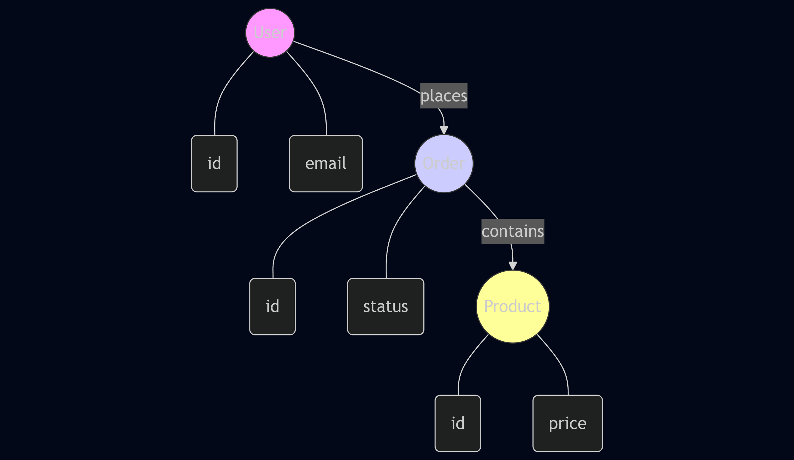
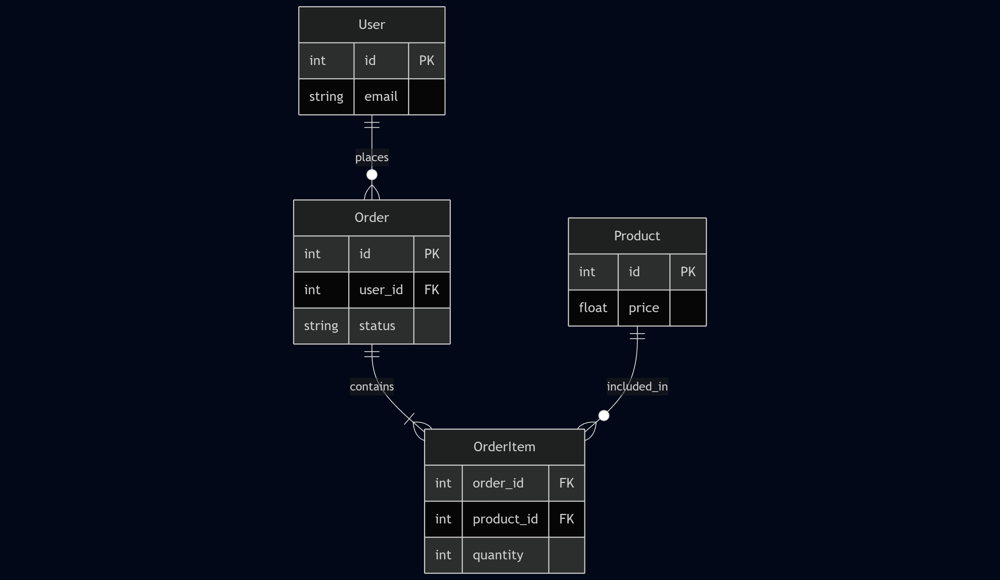

# Lab 1: Database Design (Entity Relationship)

## 1. ER Diagrams

### Chen Notation


### Crow's Foot Notation


## 2. Declarative Description (DBML)
Description is located in: [diagrams/schema.dbml](./diagrams/schema.dbml)

## 3. Code Representation (TypeScript)
Types are defined in: [types.ts](./types.ts)

## 4. JSON Schema
```json
{
  "type": "object",
  "properties": {
    "id": { "type": "integer" },
    "user_id": { "type": "integer" },
    "status": { "type": "string" }
  },
  "required": ["id", "user_id"]
}